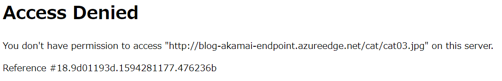

こんにちは、Azure テクニカル サポート チームです。

Azure Front Door は、世界中に展開された Microsoft のリソースを用いて、レイヤー 7 (HTTP/HTTPS 層) で動作する負荷分散サービスとなります。
このブログでは、Azure Front Door の概要と、よくお問い合わせをいただく App Service などへのセキュアな接続の構成についてご紹介します。

<!-- more --> 

<br>

<span id="frontdoor-overview"></span>

## <a href="#frontdoor-overview">Azure Front Door の 概要</a>

Azure でご利用いただける負荷分散サービスやご選択いただく考え方としては、公開情報 [Azure 負荷分散を理解する](https://docs.microsoft.com/ja-jp/azure/architecture/guide/technology-choices/load-balancing-overview) に記載がございます。
この中で、Azure Front Door は、グローバル リージョンでご利用いただけるレイヤー 7 で動作する負荷分散サービスであり、公開情報 [Azure Front Door とは](https://docs.microsoft.com/ja-jp/azure/frontdoor/front-door-overview) に記載がございます通り、下記の機能がご利用いただけます。

* スプリット TCP ベースの エニーキャスト プロトコル を使用したアプリケーションのパフォーマンスの高速化
* インテリジェントな 正常性プローブ によるバックエンド リソースの監視
* 要求の URL パス ベース のルーティング
* 効率的なアプリケーション インフラストラクチャを実現する、複数の Web サイトのホスティング
* Cookie ベースの セッション アフィニティ
* SSL オフロード と証明書管理
* 独自の カスタム ドメイン の定義
* Web Application Firewall (WAF) が統合されたアプリケーション セキュリティ
* URL リダイレクト による、HTTPS への HTTP トラフィックのリダイレクト
* URL 書き換え によるカスタム転送パス
* エンド ツー エンドの IPv6 接続と HTTP/2 プロトコル のネイティブ サポート

<br>

<span id="frontdoor-lockdown-overview"></span>

## <a href="#frontdoor-lockdown-overview">Azure Front Door についてよく寄せられる質問 FAQ</a>

Azure Front Door は上記の通り多くの機能を要しておりますが、よくお問い合わせいただく構成としては、ご利用いただいている App Service を WAF などで保護するために Azure Front Door のご利用をご検討いただくお客様が多くいらっしゃいます。
[Azure Front Door についてよく寄せられる質問](https://docs.microsoft.com/ja-jp/azure/frontdoor/front-door-faq) では、Azure をご利用いただいているお客様からいただくご質問についてご案内しておりますが、このブログでは FAQ の中でも、[バックエンドへのアクセスを Azure Front Door のみにされたい構成] (https://docs.microsoft.com/ja-jp/azure/frontdoor/front-door-faq#how-do-i-lock-down-the-access-to-my-backend-to-only-azure-front-door) について、ご紹介させていただきます。

<br>

<span id="frontdoor-lockdown-ip"></span>

## <a href="#frontdoor-lockdown-ip">Azure Front Door で用いられる IP アドレス FAQ</a>

Azure Front Door では、Azure Front Door にクライアントが接続するためのパブリック IP アドレスと、Azure Front Door からバックエンドのリソースに接続する際に用いられるパブリック IP アドレスは異なります。
Azure Fornt Door で用いられるパブリック IP アドレスは、[Azure IP 範囲とサービス タグ](https://www.microsoft.com/en-us/download/details.aspx?id=56519) で公開されており、Azure Front Door からバックエンドに構成されたリソースに接続する際のパブリック IP アドレスは「AzureFrontDoor.Backend」セクションで公開されています。
このパブリック IP アドレスの範囲の中から任意の IP アドレスが用いられる動作となり、この IP アドレスの範囲を指定することはできません。

そのため、例えばバックエンドに仮想マシンを配置されている構成であれば、NSG のサービス タグで「AzureFrontDoor.Backend」からの HTTP/HTTPS 通信を許可いただければ、Azure Front Door 以外からのパブリック IP アドレスの接続は許可されない動作となります。

<br>

<span id="frontdoor-lockdown-fdid"></span>

## <a href="#frontdoor-lockdown-fdid">Azure Front Door の固有のリソース ID FAQ</a>

Azure Front Door では、バックエンドへの通信時の HTTP ヘッダーに "X-Azure-FDID" が追加され、この値にお客様のリソースに固有の ID 割り当てられています。
IP アドレスでの制御に加えて、この HTTP ヘッダー「X-Azure FDID」を、アプリケーション上でフィルター処理することで、お客様の Azure Front Door からの接続のみに限定することができます。

Azure Front Door のリソース ID は、Azure ポータルの Azure Front Door リソースの 概要 にある "フロント ドア ID" から確認できます。
コマンドであれば、下記のコマンドから "frontdoorId" を確認できます。

[Azure PowerShell (Get-AzFrontDoor)](https://docs.microsoft.com/ja-jp/powershell/module/az.frontdoor/get-azfrontdoor?view=azps-5.7.0)
[Azure CLI (az network front-door show)](https://docs.microsoft.com/ja-jp/cli/azure/ext/front-door/network/front-door?view=azure-cli-latest#ext_front_door_az_network_front_door_show)

<br>

<span id="frontdoor-lockdown-appservice"></span>

## <a href="#frontdoor-lockdown-appservice">App Service における制限設定</a>

Azure Front Door のバックエンドに App Service を配置している構成においては、App Service の機能を用いてアクセス制限を構成することが可能です。
具体的な設定方法については、[Azure App Service のアクセス制限を設定する](https://docs.microsoft.com/ja-jp/azure/app-service/app-service-ip-restrictions#restrict-access-to-a-specific-azure-front-door-instance) で紹介しています。
設定値について抜粋すると下記の通りとなります。

* [サービス タグ](https://docs.microsoft.com/ja-jp/azure/app-service/app-service-ip-restrictions#set-a-service-tag-based-rule-preview) において、「AzureFrontDoor.Backend」を指定する
* X-Azure-FDID において、Azure Front Door の固有のリソース ID を指定する

 

<br>

<span id="frontdoor-lockdown-sample"></span>

## <a href="#frontdoor-lockdown-sample">アプリケーション上のサンプル (IIS) FAQ</a>

仮想マシン上で動作するアプリケーションにおいては、お客様の構成範囲となりますため、Azure サポート担当から具体的な設定のご支援は出来かねますが、例えば IIS であれば、下記が設定の一例として上げられます。
お客様が構成されたアプリケーションに適した形にご変更ください。


```xml
<?xml version="1.0" encoding="UTF-8"?>
<configuration>
    <system.webServer>
        <rewrite>
            <rules>
                <rule name="Filter_X-Azure-FDID" patternSyntax="Wildcard" stopProcessing="true">
                    <match url="*" />
                    <conditions>
                        <add input="{HTTP_X_AZURE_FDID}" pattern="xxxxxxxx-xxxx-xxxx-xxxx-xxxxxxxxxxxx" negate="true" />
                    </conditions>
                    <action type="AbortRequest" />
                </rule>
            </rules>
        </rewrite>
    </system.webServer>
</configuration>
```

<br>

本ブログが皆様のお役に立てれば幸いです。
